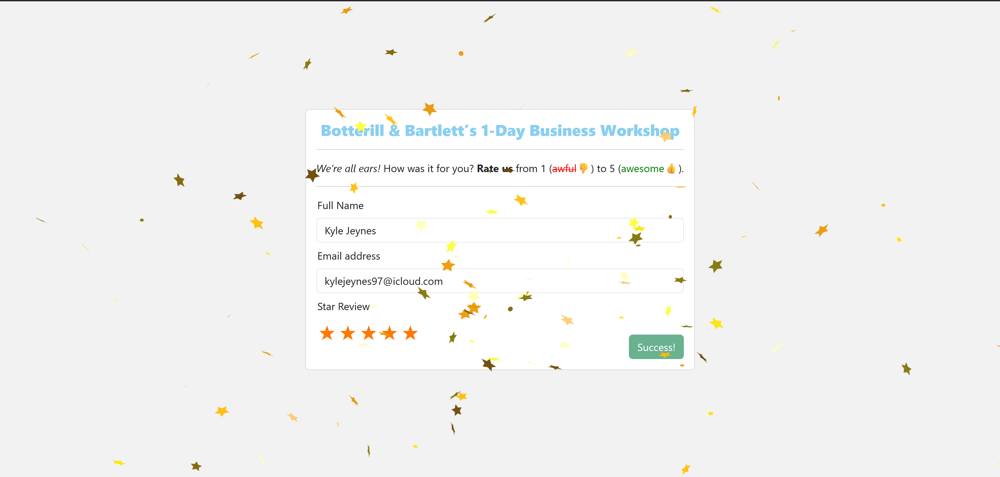

### Installation

I went ahead and configured a docker environment to make this as simple as possible. You can simply run `docker-compose up -d` inside the root directory and access the service via `127.0.0.1:80` (feel free to change the port).

For convinience, I have shipped this with no .git-ignore and left the composer.phar in the directory should you need to do anything.

### Explanation

As I explained on the form I submitted, I come from an extensive VueJS and PHP background so I have focused as much as possible on my strong points but also show you how easily I learn by providing a comprehensive UI.

This being said, I have created a mini-framework in about 2-3 hours that provides a foundation to the application whilst focusing on extendability as well as maintainability.

I had a little fun with this and probably got a little carried away but I find writing PHP a hobby and an interest so I hope you enjoy rating! ✨

### Persisted Storage & Testability

Feel free to wire up a service for the submission, you can easily add a database or redis instance to the containers and write a service to implement the ISubmissionService allowing greater flexibility. This can be configured in the `bootstrap.php`.

Mocking the service is made simple which isolates the business logic and allows for robust testing.

### Screenshot

### Sign Off

Kind Regards,
Kyle Jeynes